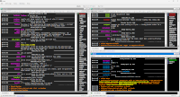
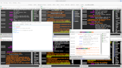
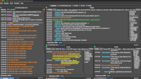

   
  <b><big>Cross-Platform Open Source IRC Client</big></b> 
  <i>A multiple-document interface IRC client for Windows, Linux, and macOS</i>  
  <b><big>Current stable release: <a href="https://github.com/nutjob-laboratories/merk/releases/tag/0.051.950">MERK 0.051.950</a></big></b> 
  <b>Current development version: <a href="https://latest.merk.chat">MERK 0.051.966</a></b>  
  <b><a href="https://buymeacoffee.com/danhetrick">Help Fund MERK!</a></b>

**MERK** is a cross-platform graphical [open source](https://www.gnu.org/licenses/gpl-3.0.en.html) [IRC](https://en.wikipedia.org/wiki/Internet_Relay_Chat) client written in Python 3 with [PyQt5](https://pypi.org/project/PyQt5/) and [Twisted](https://twistedmatrix.com/trac/). It uses a [multiple-document interface](https://en.wikipedia.org/wiki/Multiple-document_interface), much like the classic Windows client [mIRC](https://www.mirc.com/) — but unlike mIRC, **MERK** is completely free and open source. It's designed to be easy and intuitive for new users, while staying powerful and deeply customizable for everyone else. You never have to delve deeper into the interface than you want to.

**MERK** is in active development and updated frequently. Visit the project at [https://merk.chat](https://merk.chat), get the latest release at [https://download.merk.chat](https://download.merk.chat), or grab the development version at [https://latest.merk.chat](https://latest.merk.chat).

**Support the project:** if you'd like to help fund **MERK**, please consider [donating](https://buymeacoffee.com/danhetrick). Anyone who donates $50 or more gets their name immortalized on the "patrons" tab in **MERK**'s "about" dialog. **MERK** will always be free and open source. Let's keep IRC alive in the 21st century!

| Windows | Linux  | macOS  |
| :----:    | :----:    | :----:    |
 |  | 

- [Downloads](#downloads)
- [Quick Start](#quick-start)
- [Features](#features)
- [Documentation](#documentation)
- [Community & Contact](#community--contact)
- [Helping Out](#helping-out)
- [About MERK](#about-merk)

# Downloads

All files are packed in [ZIP archives](https://en.wikipedia.org/wiki/ZIP_(file_format)) unless otherwise noted. Direct downloads below are for the current development version.

| Type| Platform  | Download  |
| :----:    | :----:    | :----:    |
| User Guide |  PDF  | [MERK User Guide](./MERK_User_Guide.pdf)  |
| Current Release |  All  | [MERK 0.051.950 Release](https://github.com/nutjob-laboratories/merk/releases/tag/0.051.950)  |
| Zip Archive |  Cross-Platform Python  | [Download MERK 0.051.966 (10.93 MB)](https://www.dropbox.com/scl/fi/cux4yf7ge451jvwqdw1u9/merk-latest.zip?rlkey=7e53i142jtw01lwrfzn259z4h&dl=1)  |
| Zip Archive |  Linux Executable | [Download MERK 0.051.966 (97.02 MB)](https://www.dropbox.com/scl/fi/xma3afmie19kyutf2eo9k/merk-linux-latest.zip?rlkey=1l13ta59fi7o9lyi3ycu9qkb0&st=a2xc713e&dl=1)  |
| Flatpak |  Linux Flatpak | [Download MERK 0.051.966 (71.28 MB)](https://www.dropbox.com/scl/fi/hhcrqrgjacksm6pir8p3u/merk-latest.flatpak?rlkey=cypundhha86v0daloitkfoojn&st=mhxh1wpf&dl=1)  |
| Zip Archive|  Windows Executable | [Download MERK 0.051.966 (47.91 MB)](https://www.dropbox.com/scl/fi/ek2pvk6avluxyupo2zvz1/merk-windows-latest.zip?rlkey=nzgneoqtvrcnepyhy4yq7mzlq&dl=1)|
| Windows Installer |  Windows Setup | [Download MERK 0.051.966 (45.45 MB)](https://www.dropbox.com/scl/fi/30fd0eaeo5vszsy8haeui/merk-windows-setup.zip?rlkey=e44zsw9nle8jkny7ve6tgbh48&dl=1)|

# Quick Start

The Windows and Linux builds are made with [PyInstaller](https://www.pyinstaller.org/) and run without installing Python or any libraries. All command-line arguments work the same on every version of **MERK** — run `merk --help` (or `python merk.py --help`) to see all 30+ options, or see the [full reference](./COMMANDS.md#command-line-usage).

### Windows

Run the [installer](https://www.dropbox.com/scl/fi/0u1vcg5xuntzs2b16e01b/merk_setup.zip?rlkey=8avj1gyed3txz1nfj9ev41mmh&st=zlve4c1o&dl=1) (unzip and double-click `setup.exe`), or [download the zip](https://www.dropbox.com/scl/fi/fnu5uasoo2dzmzwiferhw/merk-windows-latest.zip?rlkey=9fke2qid0gna4n4zt00v0uhhy&dl=1), unzip anywhere, and double-click `merk.exe`. To update, just install the newer version over the old one (or extract the zip over the old files).

### Linux

[Download the zip](https://www.dropbox.com/scl/fi/xma3afmie19kyutf2eo9k/merk-linux-latest.zip?rlkey=1l13ta59fi7o9lyi3ycu9qkb0&st=a2xc713e&dl=1), unzip anywhere, and run `merk`. Both [X11](https://www.x.org/wiki/) and [Wayland](https://wayland.freedesktop.org/) are supported.

If you prefer [Flatpak](https://flatpak.org/), [download the Flatpak](https://www.dropbox.com/scl/fi/hhcrqrgjacksm6pir8p3u/merk-latest.flatpak?rlkey=cypundhha86v0daloitkfoojn&st=mhxh1wpf&dl=1) and install it with:

    flatpak install --user merk-latest.flatpak

You may need to restart your window manager for the menu entry to appear. To update, install the newer Flatpak the same way.

### macOS

Install Python 3.13 with [Homebrew](https://brew.sh/), then download and extract the [cross-platform zip](https://www.dropbox.com/scl/fi/cux4yf7ge451jvwqdw1u9/merk-latest.zip?rlkey=7e53i142jtw01lwrfzn259z4h&dl=1) and set up a virtual environment:

    brew install python@3.13
    cd /path/to/merk
    python3.13 -m venv .venv
    source .venv/bin/activate
    pip install --upgrade pip
    pip install pyqt5 Twisted pyOpenSSL service_identity

Then run **MERK** with:

    python merk.py

To launch from a shortcut or script, activate the virtual environment first:

    source /path/to/merk/.venv/bin/activate && python /path/to/merk/merk.py

### Running from source (any platform)

**MERK** requires Python 3.09+, [PyQt5](https://pypi.org/project/PyQt5/), and [Twisted](https://twistedmatrix.com/trac/). For SSL/TLS connections, `pyOpenSSL` and `service_identity` are also needed:

    pip install pyqt5 Twisted pyOpenSSL service_identity

On Windows, you may also need `pywin32` (`pip install pywin32`). Download the [cross-platform zip](https://www.dropbox.com/scl/fi/cux4yf7ge451jvwqdw1u9/merk-latest.zip?rlkey=7e53i142jtw01lwrfzn259z4h&dl=1), extract it, and run:

    python merk.py

Four libraries come bundled with **MERK**: [qt5reactor 0.6.3](https://github.com/twisted/qt5reactor), [pyspellchecker 0.8.3](https://github.com/barrust/pyspellchecker), [emoji 2.15.0](https://github.com/carpedm20/emoji), and [pike 0.2.0](https://github.com/pyarmory/pike).

# Features

- **Runs on Windows, Linux, and macOS**, with stand-alone binaries for Windows and Linux and a Flatpak for Linux
- **Multiple-document interface**, like the classic mIRC — each server, channel, and private chat gets its own subwindow
- **Multiple simultaneous connections** — chat on more than one IRC server at a time, via TCP/IP or SSL/TLS, with SASL support and a built-in list of over 200 IRC servers
- **Nearly 400 settings**, almost all changeable in the GUI and applied instantly, no restart or config-file editing required — **MERK** may be the most configurable IRC client ever created
- **Full scripting engine** with a built-in syntax-highlighting editor, connection scripts, flow control, aliases, macros, and application-wide hotkeys
- **Python plugins** that can react to over 40 IRC and application events, with full access to the [Twisted IRC client](https://docs.twisted.org/en/stable/api/twisted.words.protocols.irc.IRCClient.html) — written, edited, and exported entirely inside the application
- **Complete theming** — all text colors and backgrounds can be customized per-channel with a built-in style editor, plus dark mode and default styles for both light and dark
- **Automatic logging** of channels and private chats, stored as JSON with export to CSV, "human readable", or custom formats. Saved logs can be viewed in the application with support for IRC colors and formatting display, and clickable links
- **Quality-of-life everywhere**: spell checking in 8 languages, autocomplete for commands/nicknames/channels/emojis, [emoji](https://en.wikipedia.org/wiki/Emoji) and [ASCIImoji](https://asciimoji.com/) shortcodes, message filtering (hide JOIN/PART/QUIT and friends), audio notifications, and full IRC color support
- **[MERK "markdown"](./COMMANDS.md#merk-markdown)** for injecting IRC colors and *italic*, **bold**, <u>underline</u>, and ~~strikethrough~~ formatting into messages with plain text
- **Over 80 commands** for use in the client or in scripts — see the [full command reference](./COMMANDS.md)
- **Open source** ([GPL 3](https://www.gnu.org/licenses/gpl-3.0.en.html)) with built-in documentation

# Documentation

- **[MERK User Guide](./MERK_User_Guide.pdf)** — the complete manual, covering everything from first connection to writing plugins
- **[Command reference](./COMMANDS.md)** — every client and scripting command, command-line usage, and MERK "markdown"
- **[Plugin examples](./plugin_examples)** — example plugins to get you started
- **[CHANGELOG](./CHANGELOG)** — changes in the current development version

# Community & Contact

Join the official **MERK** IRC channel: **#merk** on the MansionNET network. Connect via the built-in server suggestions, or at **irc.inthemansion.com**, port **6697** (SSL). I'm an [IRCop](https://en.wikipedia.org/wiki/IRC_operator) on MansionNET, and I'm usually in **#merk** and **#lobby**. You can also drop me an [email](mailto:dhetrick@gmail.com).

# Helping Out

Yes, **MERK** needs help! It's written by me, [Dan Hetrick](https://github.com/danhetrick), and I can't do everything this software needs:

- **[Donate!](https://buymeacoffee.com/danhetrick)** — If you like **MERK**, like IRC, or just want to help out some open source developer, [donate to **MERK** today!](https://buymeacoffee.com/danhetrick)
- **Icons and graphics** — I'm a programmer, not an artist, and I think that shows!
- **Packaging** — I'd love to provide a `pip` package, but I have little experience with it
- **Proxy support** — SOCKS4/5 and HTTP proxy connections are on the wishlist
- **DCC chat and file transfers** — the DCC functionality in Twisted is undocumented, and I can't make heads or tails of it
- **Using MERK and giving feedback** — tell me what you love and what you hate! I can't promise I'll add everything, but I love hearing how people use **MERK**

# About MERK

**Why does MERK exist?** I've used many, *many* IRC clients, and none of them felt *right* — not customizable enough, missing features, or just plain ancient-looking. I fell out of love with the "single window" interface most clients use, remembered using [mIRC](https://www.mirc.com/) fondly back in the day, and decided to write a modern client with that multiple-document interface style. **MERK** is my "dream IRC client" — easy to get started with, but *deep* — and I hope it can become yours too!

**What does MERK mean?** If you pronounced "IRC" as a word instead of an acronym, it'd probably come out as /*Ərk*/ (which was the name of [my previous client](https://github.com/nutjob-laboratories/erk)). Since this client connects to **m**ultiple servers using a **m**ultiple-document interface — and "MDIIRC" doesn't exactly roll off the tongue — we combined the "M" with the word-pronunciation of IRC, and came up with **MERK**!

[//]: # (End of document)
