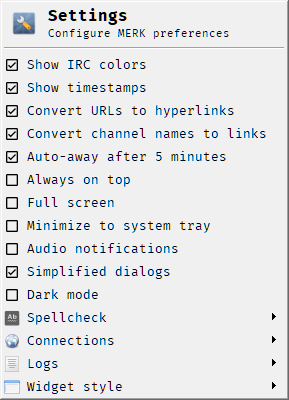

<p align="center">
  <br>
  <b><big>Open Source IRC Client</big></b><br>
  <i>A multiple-document interface IRC client for Windows and Linux</i><br>
  <b><big>Current stable release: <a href="https://github.com/nutjob-laboratories/merk/releases/tag/0.050.750">MERK 0.050.750</a></big></b><br>
  <b>Current development version: 0.050.756</b><br><br>
  <b><a href="https://gofund.me/ae062139">Help Fund MERK!</a></b><br>
</p>

**I am currently unemployed, and having difficulty finding work.** If you'd like to help me and help support **MERK**, please consider [donating](https://gofund.me/ae062139). Anyone who donates $50 or more will get their name immortalized on the "patrons" tab in **MERK**'s "about" dialog. **MERK** will always be free, and will always be open source. Thanks for your time, and I hope you enjoy **MERK**! Let's keep IRC alive in the 21st century!

 - [Downloads](#Downloads)
 - [Summary](#Summary)
 - [Running MERK on Windows](#running-merk-on-windows)
 - [Running MERK with Python](#running-merk-with-python)
 - [Python Requirements](#python-requirements)
 - [Features](#Features)
 - [Screenshots](#screenshots)
 - [Usage](#usage)
 - [Commands](#commands)
 - [Example command-line usage](#example-command-line-usage)
 - [Why does MERK exist?](#why-does-merk-exist)
 - [What does MERK mean?](#what-does-merk-mean)
 - [Does MERK need any help?](#does-merk-need-any-help)

# Downloads
All files are packed in [ZIP archive files](https://en.wikipedia.org/wiki/ZIP_(file_format)), unless otherwise noted. All files available for direct download below are for the current development version of **MERK**. If you have previously installed **MERK** and would like to update to a new version, just [download the installer](https://www.dropbox.com/scl/fi/okp7zrjy25p1v3rox00p1/merk_setup.zip?rlkey=ey9f78jqzzp9ldjbqgwikk8uc&dl=1) and install **MERK** again; your install will be updated to the latest version.

| Type| Platform  | Download  |
| :----:    | :----:    | :----:    |
| User Guide |  PDF  | [MERK User Guide](./MERK_User_Guide.pdf)  |
| Current Release |  -  | [MERK 0.050.750 Release](https://github.com/nutjob-laboratories/merk/releases/tag/0.050.750)  |
| Zip Archive|  Cross-platform  | [Download MERK 0.050.756 (12.05 MB)](https://www.dropbox.com/scl/fi/pf9p7ltb3uufm5akjz7l0/merk-latest.zip?rlkey=3caodopybbcxr4p9grxygxzym&st=01zsuura&dl=1)  |
| Zip Archive|  Windows EXE | [Download MERK 0.050.756 (48.89 MB)](https://www.dropbox.com/scl/fi/4w9ufyknzac24o06710bi/merk-windows-latest.zip?rlkey=zmir67l3klg8mw0omxayzmssc&st=vb69tsdi&dl=1)|
|   Windows Installer|  Windows Setup | [Download MERK 0.050.756 (46.05 MB)](https://www.dropbox.com/scl/fi/0u1vcg5xuntzs2b16e01b/merk_setup.zip?rlkey=8avj1gyed3txz1nfj9ev41mmh&st=zlve4c1o&dl=1)|

# Summary
  
**MERK** is a graphical [open source](https://www.gnu.org/licenses/gpl-3.0.en.html) [Internet relay chat](https://en.wikipedia.org/wiki/Internet_Relay_Chat) client. The current development version is **0.050.756**. It uses a [multiple-document interface](https://en.wikipedia.org/wiki/Multiple-document_interface), much like the popular Windows IRC client [mIRC](https://www.mirc.com/).  **MERK** is written in Python 3, using the [PyQt5](https://pypi.org/project/PyQt5/) and [Twisted](https://twistedmatrix.com/trac/) libraries, and runs on both Windows and Linux. **MERK** is updated frequently with new features and bugfixes.

**MERK** is still in development, but it works, and can be used for most IRC activities. [The current stable release of **MERK** is version 0.050.750](https://github.com/nutjob-laboratories/merk/releases/tag/0.050.750). **MERK** has a user guide, which can be [viewed here](./MERK_User_Guide.pdf).

Join me on the official **MERK** IRC channel, **#merk** on the Libera Chat network! Connect to  Libera in the client as one of the built-in server suggestions, or at **irc.libera.chat**, port **6667** (you can also connect via SSL on port **6697**). Honestly, I'm working a lot, so I'm almost always idle, but I pop in and chat a few times a day!

# Running MERK on Windows
**MERK** has a version built with [PyInstaller](https://www.pyinstaller.org/) which you can run without having to install Python or any of the requirements. [You can download the current stable release (0.050.750) here](https://github.com/nutjob-laboratories/merk/releases/tag/0.050.750). For more information on **MERK** and how it works, [check out the user guide](./MERK_User_Guide.pdf).

To run the current development  version of **MERK**, [download this zip file](https://www.dropbox.com/scl/fi/fnu5uasoo2dzmzwiferhw/merk-windows-latest.zip?rlkey=9fke2qid0gna4n4zt00v0uhhy&dl=1) and unzip to any directory, and double click on `merk.exe` to run the client. If you [download the installer](https://www.dropbox.com/scl/fi/0u1vcg5xuntzs2b16e01b/merk_setup.zip?rlkey=8avj1gyed3txz1nfj9ev41mmh&st=zlve4c1o&dl=1), unzip and double click on `setup.exe` to install **MERK**. You can install **MERK** any place you'd like.

If you have previously installed **MERK** and would like to update to a new version, just download the installer for the newer version and install **MERK** again; your install will be updated to the newer version. To update the `merk.exe` version, extract the [zip file](https://www.dropbox.com/scl/fi/fnu5uasoo2dzmzwiferhw/merk-windows-latest.zip?rlkey=9fke2qid0gna4n4zt00v0uhhy&dl=1), overwriting the older version of **MERK**.

A note: all command-line arguments, as documented below, work on the all versions of **MERK**.

# Running MERK with Python

First, make sure that all the [requirements](#python-requirements) are installed. Next, [download](https://www.dropbox.com/scl/fi/pf9p7ltb3uufm5akjz7l0/merk-latest.zip?rlkey=3caodopybbcxr4p9grxygxzym&st=01zsuura&dl=1) **MERK**. Extract the zipfile to a directory of your choice using your favorite archive/zip program. Open a command prompt, navigate to the directory you extracted **MERK** to, and type:

    python merk.py

# Python Requirements

**MERK** requires Python 3.09+, [PyQt5](https://pypi.org/project/PyQt5/), and [Twisted](https://twistedmatrix.com/trac/). PyQt5 and Twisted can be installed by using [**pip**](https://pypi.org/project/pip/):

    pip install pyqt5
    pip install Twisted

To connect to IRC servers via SSL, two additional libraries may be needed:

    pip install pyOpenSSL
    pip install service_identity

**MERK** is being developed with Python 3.13 on Windows 11 and Linux Mint.

If you're running Windows, and you're getting errors when trying to run **MERK**, you may have to install another library, [pywin32](https://pypi.org/project/pywin32/). You can also install this with [**pip**](https://pypi.org/project/pip/):

    pip install pywin32

To run properly on Linux, the latest version of all required software is recommended.

There are three libraries that comes bundled with **MERK**:
 - [qt5reactor 0.6.3](https://github.com/twisted/qt5reactor)
 - [pyspellchecker 0.8.3](https://github.com/barrust/pyspellchecker)
 - [emoji 2.15.0](https://github.com/carpedm20/emoji)

# Features
-   Runs on Windows and Linux
-   Supports multiple connections (you can chat on more than one IRC server at a time)
-   Open source ([GPL 3](https://www.gnu.org/licenses/gpl-3.0.en.html))
-   Uses a [multiple document interface](https://en.wikipedia.org/wiki/Multiple-document_interface), much like popular Windows IRC client [mIRC](https://www.mirc.com/)
- Built-in [documentation](./MERK_User_Guide.pdf)!
- Dark mode!
- Audio notifications
  - Can be triggered by seven different events, with each one able to be turned on and off
  - Uses any WAV file as the notification sound, and can be set in the GUI
- Very configurable, without having to manually edit a configuration file
    - Control application behavior, logging, features, and more!
    - Over 240 different settings can be changed, allowing you to customize **MERK** to look and function _exactly_ the way you want it to look and function.
    - Almost all settings can be changed in the settings dialog without a restart. Have fun testing different options!
 -  Extensive command-line options
-   A built-in list of over 80 IRC servers to connect to
-   All text colors (and backgrounds) can be customized
    - Individual channels can have their own color schemes
    - User input text can highlight channels, nicknames, commands, and more as you type!
    - Styles are saved and loaded automatically
    - Easy to use GUI text style editor is built-in
    - Changes to text style are immediate, without having to restart!
-   Built-in [spell checker](https://github.com/barrust/pyspellchecker) (supports English, Spanish, French, German, Portuguese, Italian, Dutch, and Russian)
-   [Emoji](https://en.wikipedia.org/wiki/Emoji) support
    -   Insert emojis into chat by using shortcodes (such as `:joy:` 😂, `:yum:` 😋, etc.)
    -   A list of supported emoji short codes can be found [here](https://carpedm20.github.io/emoji/all.html?enableList=enable_list_alias)
-   Full IRC color support
-   Full scripting engine
    - Includes a built in script editor, with scripting macros and syntax highlighting
    - Automatically execute scripts on connection (to join channels, login in ChanServ, etc.)
-   Automatic logging of channel and private chats
    - Includes a utility to export logs to JSON, CSV, or your own custom format
    - Logs are stored in JSON, so parsing/scraping your own logs in easy

# Screenshots

<p><small><i>Screenshots may not reflect the current release (0.050.750), and may reflect the current development version (0.050.756). More screenshots are in the <a href="./MERK_User_Guide.pdf">MERK User Guide</a>.</i></small></p>

<p align="center">
<center><a href="./graphics/screenshot_big.png"></a></center></br>
 <center><i><small>MERK connected to <a href="https://libera.chat/">Libera</a> and <a href="http://www.efnet.org/">EFnet</a>, on Windows 11, using the "windows" widget set. </small></i></center>
 </p>
 
 <p align="center">
 <center><a href="./graphics/screenshot_linux_big.png"></a></center></br>
  <center><i><small>MERK connected to <a href="https://www.dal.net/">DALnet</a>, <a href="https://freenode.net/">Freenode</a>, and <a href="https://libera.chat/">Libera</a> on Linux Mint 20.2 in "dark mode", using the "windows" widget set.</small></i></center>
  </p>

  <p align="center">
 <center><a href="./graphics/connect_1.png"></a><a href="./graphics/connect_2.png"></a><a href="./graphics/connect_3.png"></a></center></br>
  <center><i><small>The MERK connection dialog, the first thing users see when running MERK. All settings are saved automatically, including the connection script. The extra text describing how the individual settings work can be removed with the "Simplified dialogs" option in settings.</small></i></center>
  </p>

  <p align="center">
 <center><a href="./graphics/styler.png"></a></center></br>
  <center><i><small>The text style dialog. The text style can be edited for all windows/channels, or for specific channels. Styles are saved by network, so they are applied no matter what server you're connected to. Changes, once saved, are automatically and instantly applied.</small></i></center>
  </p>

  <p align="center">
 <center><a href="./graphics/settings.png"></a></center></br>
  <center><i><small>The first "page" of the settings dialog. MERK features over 240 settings that can be tweaked until MERK looks and works exactly like you want it to. All settings (except for "dark mode") are applied instantly.</small></i></center>
  </p>

  <p align="center">
 <center><a href="./graphics/menu.png"></a></center></br>
  <center><i><small>The settings menu also includes many commonly used settings that can be toggled directly, without opening the settings dialog. All settings in this menu are applied instantly.</small></i></center>
  </p>

  <p align="center">
 <center><a href="./graphics/channels.png"></a></center></br>
  <center><i><small>The channel list dialog, listing all visible channels on a server. The list can be searched and filtered by user count. This screenshot shows the channel list for the <a href="https://libera.chat/">Libera</a> network. The instructional text can be removed with the "Simplified dialogs" option in settings.</small></i></center>
  </p>
  
  <p align="center">
 <center><a href="./graphics/editor_screenshot.png"></a></center></br>
  <center><i><small>The script editor, with an example file open. In the editor, you can edit, create, and execute MERK scripts. The editor features syntax highlighting, which highlights commands, channels, aliases, and comments, as well as command generator macros, making it easy to write scripts.</small></i></center>
  </p>

<p align="center">
 <center><a href="./graphics/log_manager_screenshot.png"></a></center></br>
  <center><i><small>The log manager, where you can search, view, export, and manage MERK logs. Logs can be exported to JSON or a custom delimited text format.</small></i></center>
  </p>

# Usage
```
usage: python merk.py [--ssl] [-p PASSWORD] [-c CHANNEL[:KEY]] [-a NICKNAME]
                      [-C SERVER:PORT[:PASSWORD]] [-n NICKNAME] [-u USERNAME]
                      [-S SERVER:PORT[:PASSWORD]] [-r REALNAME] [-h] [-d] [-x] 
                      [-t] [-R] [-o] [-f] [-s FILENAME][--config-name NAME] 
                      [--config-directory DIRECTORY] [--config-local]
                      [--scripts-directory DIRECTORY] [--user-file FILENAME]
                      [--config-file FILENAME] [--reset] [--reset-user]
                      [--reset-all] [-Q NAME] [-D] [-L]
                      [SERVER] [PORT]


Connection:
  SERVER                Server to connect to
  PORT                  Server port to connect to (6667)
  --ssl, --tls          Use SSL/TLS to connect to IRC
  -p, --password PASSWORD
                        Use server password to connect
  -c, --channel CHANNEL[:KEY]
                        Join channel on connection
  -C, --connect SERVER:PORT[:PASSWORD]
                        Connect to server via TCP/IP
  -S, --connectssl SERVER:PORT[:PASSWORD]
                        Connect to server via SSL/TLS

User Information:
  -n, --nickname NICKNAME
                        Use this nickname to connect
  -u, --username USERNAME
                        Use this username to connect
  -a, --alternate NICKNAME
                        Use this alternate nickname to connect
  -r, --realname REALNAME
                        Use this realname to connect

Options:
  -h, --help            Show help and usage information
  -d, --donotsave       Do not save new user settings
  -x, --donotexecute    Do not execute connection script
  -t, --reconnect       Reconnect to servers on disconnection
  -R, --run             Don't ask for connection information on start
  -o, --on-top          Application window always on top
  -f, --full-screen     Application window displays full screen
  -s, --script FILE     Use a file as a connection script

Files and Directories:
  --config-name NAME    Name of the configuration file directory (default: .merk)
  --config-directory DIRECTORY
                        Location to store configuration files
  --config-local        Store configuration files in install directory
  --scripts-directory DIRECTORY
                        Location to look for script files
  --user-file FILE      File to use for user data
  --config-file FILE    File to use for configuration data
  --reset               Reset configuration file to default values
  --reset-user          Reset user file to default values
  --reset-all           Reset all configuration files to default values

Appearance:
  -Q, --qtstyle NAME    Set Qt widget style (default: Windows)
  -D, --dark            Run in dark mode
  -L, --light           Run in light mode
```
# Commands
All of these commands can be issued in the client, or from scripts, unless otherwise noted.

| Commands                                | Description                                                                                                                      |
|-----------------------------------------|----------------------------------------------------------------------------------------------------------------------------------|
| `/alias [TOKEN] [TEXT...]`                  | Creates an alias that can be referenced by `$TOKEN`. Call with only `TOKEN` as an argument to see `TOKEN`'s value. If `TEXT` is a mathematical statement, it will be evaluated and the result used as the alias' value. Operations supported are parenthesis, addition (`+`), subtraction (`-`), multiplication (`*`), division (`/`), modulus (`%`), and exponents(`**`). Call without any arguments to see all aliases and their values'                                                                              |
| `/away [MESSAGE]`                       | Sets status as "away"                                                                                                            |
| `/back`                                 | Sets status as "back"                                                                                                            |
| `/cascade`                              | Cascades all subwindows                                                                                                          |
| `/clear [SERVER] [WINDOW]`              | Clears a window's chat display. `SERVER` is optional if `WINDOW` belongs to the same context                                                                                                    |
| `/close [SERVER] [WINDOW]`              | Closes a subwindow. `SERVER` is optional if `WINDOW` belongs to the same context                                                                                          |
| `/config [SETTING] [VALUE...]`          | Changes a setting, or searches and displays one or all settings in the configuration file.  ***Caution**: use at your own risk! |
| `/connect SERVER [PORT] [PASSWORD]`     | Connects to an IRC server                                                                                                        |
| `/connectssl SERVER [PORT] [PASSWORD]`  | Connects to an IRC server via SSL                                                                                                |
| `context WINDOW_NAME`                  | Moves execution of the script to `WINDOW_NAME`; *can only be called from scripts*                                                  |
| `/ctcp REQUEST USER`                  | Sends a CTCP request to `USER`; valid `REQUEST`s are TIME, VERSION, USERINFO, SOURCE, or FINGER                                                  |
| `/delay SECONDS COMMAND...`                  | Executes `COMMAND` after `SECONDS` seconds                                                 |
| `/edit [FILENAME]`                      | Opens a script in the editor                                                                                                     |
| `end`                                  | Immediately ends a script; *can only be called from scripts*                                                                       |
| `exclude WINDOW...`                       | Prevents a script from executing in `WINDOW`'s context. Multiple `WINDOW`s can be specified. *Can only be called from scripts*              |
| `/exit [SECONDS]`                       | Exits the client, with an optional pause of `SECONDS` before exit                                                                |
| `/find [TERMS]`                         | Finds filenames that can be found by other commands; use * for multi-character wildcards, and ? for single character wildcards   |
| `/focus [SERVER] [WINDOW]`              | Sets focus on a subwindow. `SERVER` is optional if `WINDOW` belongs to the same context                                                                                          |
| `/fullscreen`                           | Toggles full screen mode   |
| `goto LINE_NUMBER`                         | Moves execution of the script to `LINE_NUMBER`. The only script-only command that can be issued from an `if` command. Cannot be used to move to a line that consists of a script-only command other than `end`. Can only be called from scripts  |
| `halt [MESSAGE...]`                       | Halts a script's execution, and displays an error `MESSAGE` with line number and file name. Can only be called from scripts       |
| `/help [COMMAND]`                                 | Displays command usage information                  |
| `/hide [SERVER] [WINDOW]`                                 | Hides a subwindow. `SERVER` is optional if `WINDOW` belongs to the same context                                                                                              |
| `if VALUE1 OPERATOR VALUE2 COMMAND...`       | Executes `COMMAND` if `VALUE1` and `VALUE2` are true, depending on `OPERATOR`. Valid `OPERATOR`s are `(is)` (result is true if `VALUE1` and `VALUE2` are equal), `(not)` (result is true if `VALUE1` and `VALUE2` are not equal), `(in)` (result is true if `VALUE1` is contained in `VALUE2`), `(gt)` (result is true if `VALUE1` is a greater number than `VALUE2`), `(lt)` (result is true if `VALUE1` is a lesser number than `VALUE2`), `(ne)` (result is true if `VALUE1` is not an equal number to `VALUE2`), and `(eq)` (result is true if `VALUE1` is an equal number to `VALUE2`). Can only be called from scripts    |
| `/ignore USER`                          | Hides a `USER`'s chat; use `*` as multiple character wildcards, and `?` as single character wildcards                                                                                                           |
| `/invite NICKNAME CHANNEL`              | Sends a channel invitation                                                                                                       |
| `insert FILE [FILE...]`              | Inserts the contents of `FILE` where it appears in the script; *can only be called by scripts*            |
| `/join CHANNEL [KEY]`                   | Joins a channel                                                                                                                  |
| `/kick CHANNEL NICKNAME [MESSAGE]`      | Kicks a user from a channel                                                                                                      |
| `/knock CHANNEL [MESSAGE]`              | Requests an invitation to a channel                                                                                              |
| `/list [TERMS]`                         | Lists or searches channels on the server; use "*" for multi-character wildcard and "?" for single character                      |
| `/log`                                  | Opens the log manager                                                                                                            |
| `/macro NAME SCRIPT [USAGE] [HELP]`               | Creates a macro, executable with `/NAME`, that executes `SCRIPT`                                            |
| `/maximize [SERVER] [WINDOW]`             | Maximizes a subwindow. `SERVER` is optional if `WINDOW` belongs to the same context                                                                                                               |
| `/me MESSAGE...`                        | Sends a CTCP action message to the current chat                                                                                  |
| `/minimize [SERVER] [WINDOW]`             | Minimizes a subwindow. `SERVER` is optional if `WINDOW` belongs to the same context                                                                                                               |
| `/mode TARGET MODE...`                  | Sets a mode on a channel or user                                                                                                 |
| `/move [SERVER] [WINDOW] X Y` | Moves a subwindow to `X` (left and right) and `Y` (up and down) coordinates. `SERVER` is optional if `WINDOW` belongs to the same context                                                                              |
| `/msg TARGET MESSAGE...`                | Sends a message                                                                                                                  |
| `/msgbox MESSAGE...`                    | Displays a messagebox with a short message                                                                                                                  |
| `/next`                    | Shifts focus to the "next" subwindow                                                                                                   |
| `/nick NEW_NICKNAME`                    | Changes your nickname                                                                                                            |
| `/notice TARGET MESSAGE...`             | Sends a notice                                                                                                                   |
| `only WINDOW...`                       | Restricts a script to only executing in `WINDOW`'s context. Multiple `WINDOW`s can be specified. *Can only be called from scripts*              |
| `/oper USERNAME PASSWORD`               | Logs into an operator account                                                                                                    |
| `/part CHANNEL [MESSAGE]`               | Leaves a channel                                                                                                                 |
| `/ping USER [TEXT]`                     | Sends a CTCP ping to a user                                                                                                      |
| `/play FILENAME`                        | Plays a WAV file                                                                                                                 |
| `/previous`               | Shifts focus to the "previous" subwindow                                                                                    |
| `/print [WINDOW] TEXT...`               | Prints text to a window                                                                                                          |
| `/prints [WINDOW] TEXT...`               | Prints system message to a window                                                                                                          |
| `/private NICKNAME [MESSAGE]`               | Opens a private chat subwindow for `NICKNAME`                             |
| `/quit [MESSAGE]`                       | Disconnects from the current IRC server                                                                                          |
| `/quitall [MESSAGE]`                       | Disconnects from all IRC servers                                                                                          |
| `/random ALIAS LOW HIGH`                | Generates a random number beween `LOW` and `HIGH` and stores it in `ALIAS`                             |
| `/raw TEXT...`                          | Sends unprocessed data to the server                                                                                             |
| `/reclaim NICKNAME`                          | Attempts to change nickname to `NICKNAME` until claimed                                                                                             |
| `/reconnect SERVER [PORT] [PASSWORD]`     | Connects to an IRC server, reconnecting on disconnection                                                   |
| `/reconnectssl SERVER [PORT] [PASSWORD]`  | Connects to an IRC server via SSL, reconnecting on disconnection                                         |
| `/refresh`                              | Requests a new list of channels from the server                                                                                  |
| `/rem [TEXT...]`                        | Does nothing. Can be used as a target for `goto`                                                                              |
| `/resize [SERVER] [WINDOW] WIDTH HEIGHT` | Resizes a subwindow. `SERVER` is optional if `WINDOW` belongs to the same context                                                                              |
| `restrict SERVER`\|`CHANNEL`\|`PRIVATE`     | Prevents a script from running if it is not being ran in a `SERVER`, `CHANNEL`, or `PRIVATE` window. Up to two window types can be passed. *Can only be called from scripts*                                                                                |
| `/restore [SERVER] [WINDOW]`              | Restores a subwindow. `SERVER` is optional if `WINDOW` belongs to the same context                                                                                                                |
| `/s FILENAME [ARGUMENTS]`                      | A shortcut for the `/script` command                                                                                            |
| `/script FILENAME [ARGUMENTS]`                      | Executes a list of commands in a file                                                                                            |
| `/settings`                             | Opens the settings dialog                                                                                                        |
| `/shell ALIAS COMMAND...`               | Executes an external program, and stores the output in an alias                                                                  |
| `/show [SERVER] [WINDOW]`               | Shows a subwindow, if hidden; otherwise, shifts focus to that subwindow. `SERVER` is optional if `WINDOW` belongs to the same context                                |
| `/style`                                | Edits the current window's style                                                                                                 |
| `/tile`                                 | Tiles all subwindows                                                                                                             |
| `/time`                                 | Requests server time                                                                                                             |
| `/topic CHANNEL NEW_TOPIC`              | Sets a channel topic                                                                                                             |
| `/unalias TOKEN`                        | Deletes the alias referenced by `$TOKEN`                                                                                         |
| `/unignore USER`                        | Un-hides a `USER`'s chat. To un-hide all users, use `*` as the argument                                                         |
| `usage NUMBER [MESSAGE...]`            | Prevents a script from running unless `NUMBER` arguments are passed to it, and displays `MESSAGE`. *Can only be called by scripts*                                                        |
| `/user [SETTING] [VALUE...]`          | Changes a user setting, or searches and displays one or all settings in the user configuration file. Pass `*` as `VALUE` to set a setting as blank. ***Caution**: use at your own risk! |
| `/version [SERVER]`                     | Requests server version                                                                                                          |
| `wait SECONDS`                         | Pauses script execution for `SECONDS`; *can only be called from scripts*                                                           |
| `/who NICKNAME [o]`                     | Requests user information from the server                                                                                        |
| `/whois NICKNAME [SERVER]`              | Requests user information from the server                                                                                        |
| `/whowas NICKNAME [COUNT] [SERVER]`     | Requests information about previously connected users                                                                            |
| `/window [COMMAND] [X] [Y]`     | Manipulates the main application window. Valid commands are `move`, `size`, `maximize`, `minimize`, and `restore`. Call with no arguments to see main window information and a list of subwindows                                                 |
| `/xconnect SERVER [PORT] [PASSWORD]`    | Connects to an IRC server &amp; executes connection script                                                                       |
| `/xconnectssl SERVER [PORT] [PASSWORD]` | Connects to an IRC server via SSL &amp; executes connection script                                                               |
| `/xreconnect SERVER [PORT] [PASSWORD]`    | Connects to an IRC server &amp; executes connection script, reconnecting on disconnection                                                                       |
| `/xreconnectssl SERVER [PORT] [PASSWORD]` | Connects to an IRC server via SSL &amp; executes connection script, reconnecting on disconnection                                                              |
# Example Command-line Usage
In the following examples, the first command-line is how you would do the task using **MERK** as a Python script, and second command-line is how you would do it using the **MERK** Windows executable. Note that the command-lines, other than the initial executable, are the same!

Let's assume that you want to use the command-line to connect **MERK** to the `2600.net` network and join the `#linux` channel:
```
python merk.py --channel "#linux" irc.2600.net 6667
```
```
merk.exe --channel "#linux" irc.2600.net 6667
```
Easy, right? Now let's try something a little more complex. Let's say you want to connect the the `Libera` network, which uses SSL/TLS. You want to use a different nickname than you normally use; you want to use the nickname `merker`, but you don't want to save this nickname as your default. When you join the network, you want to join two channels: `#python` and `#merk`:
```
python merk.py --donotsave -n merker -c "#python" -c "#merk" --ssl irc.libera.chat 6697
```
```
merk.exe --donotsave -n merker -c "#python" -c "#merk" --ssl irc.libera.chat 6697
```
You can do some things with the command-line that you can't do with the GUI. Let's say that you're using **MERK** on a computer that someone else also uses for **MERK**. You want to store your configuration files in a different folder, just for your use. You always want to use light mode, no matter what the configuration file says, and you've stored some **MERK** scripts in the `C:\Merk_Scripts` folder. You don't want **MERK** to ask you for a server to connect to, you just want it to start up, and you can choose a server from the "IRC" menu:
```
python merk.py --light --config-name .mymerk --scripts-directory "C:\Merk_Scripts" --run
```
```
merk.exe --light --config-name .mymerk --scripts-directory "C:\Merk_Scripts" --run
```
Now, let's try something that commonly done with other IRC clients: connecting to multiple servers automatically on startup. You want to use your standard settings, but connect to three different IRC servers as soon as you run **MERK**: you want to connect to the 2600 network and DALNet, using standard TCP/IP,and Libera, using SSL:
```
python merk.py -C irc.2600.net:6667 -S irc.libera.chat:6697 -C us.dal.net:6667
```
```
merk.exe -C irc.2600.net:6667 -S irc.libera.chat:6697 -C us.dal.net:6667
```
This command will start up **MERK** and connect to three of these servers without any extra effort!

You can do a lot of things from the command-line. For a really complicated example, let's try this scenario. Here's what this command-line will do:

 - Connect to Libera via SSL/TLS
 - Connect to DALnet via TCP/IP
 - Make sure that we reconnect automatically if we get disconnected from either of these servers
 - Join the `#merk` and `#python` channels on both networks
 - Make sure that we don't execute any connection scripts we have set up
 - Run in "light mode", regardless of what the configuration settings say
 - Run a **MERK** script file named `stuff.merk` on connection, for both connections

Here's the set of arguments that will make all of that happen:
```
python merk.py -Ltx -s stuff.merk -S irc.libera.chat:6697 -C us.dal.net:6667 -c "#python" -c "#merk"
```
```
merk.exe -Ltx -s stuff.merk -S irc.libera.chat:6697 -C us.dal.net:6667 -c "#python" -c "#merk"
```

All command-line options are what they say on the tin: _optional_. Just running the script with no command-line options will initially open up the connection dialog, and you can do just about everything completely inside the GUI.

# Why does MERK exist?
It's simple. I don't currently like any of the other IRC clients. I've used many, _many_ other IRC clients for Windows and Linux, and they just didn't feel _right_. They weren't customizable enough, didn't have features that I wanted, or just plain looked ancient. I wanted a GUI IRC client that looked and felt modern, and could be heavily customized. My previous IRC client was called [**Ərk**](https://github.com/nutjob-laboratories/erk), and although I liked developing it and working on it, I honestly didn't use it that much. I fell out of love with the "single window" interface that so many other IRC clients use, and decided to try something "new" (and by "new" I mean 30 years old). I remembered using [mIRC](https://www.mirc.com/) back when I was younger, and decided to try and write a new client that used the [multiple-document interface](https://en.wikipedia.org/wiki/Multiple-document_interface) style I remember fondly. And thus, __MERK__ was born!

I honestly think that **MERK** may be the most configurable IRC client ever created. With over 240 different settings to work with, you can configure **MERK** to look and operate *exactly* how you want. Want to display all channel userlists on the left, or not display userlists at all? You can do that. Want to turn off all the pretty stuff, and display only raw, (nearly) unaltered text? You can do that. Maybe you want to use text styles only on the chat display, and leave the userlists and text input alone? You can do that. One of the things I hated about [XChat](http://xchat.org/)/[Hexchat](https://hexchat.github.io/) is how un-configurable the UI is, and how most other clients require plugins or scripts to change the client UI. I wanted a client where you could alter or change most aspects of the UI without needed external tools or editing configuration files manually. With **MERK**, you can change all settings in the client and see the effects instantly. There are a few settings that can only be changed by editing the configuration files, but they are for settings most users will probably never change; but you can still change them and **MERK** will compensate, and not break the client!

# What does MERK mean?
Well, if you were to pronounce "IRC" as a word and not an acronym, it would probably be pronounced _/Ərk/_. Since the client allows a user to connect to multiple IRC servers at the same time, well, that might be what the "M" stands for. Either that, or "multiple-document interface". "MDIIRC" doesn't exactly roll off the tongue, so we combined the "M" with the word-pronunciation of IRC, and came up with __MERK__!

# Does MERK need any help?
Yes! **MERK** is being written by me, [Dan Hetrick](https://github.com/danhetrick), a software developer that can not do everything that this piece of software needs. There's few things I need help with!

 - **Icons and other graphics work**. I am not a graphic designer, and I think that that shows in this project, heh. I need help with creating better icons, and a better logo for **MERK**. I'm doing my best, here, but I'm a computer programmer, not an artist!
 - **Packaging**. **MERK** now has a [PyInstaller](https://www.pyinstaller.org/)-based distribution! However, I can't seem to get PyInstaller working on a Linux binary for reasons that are beyond me. I'd love some help on getting packaging for Linux, be it with PyInstaller or anything else that's easy for end-users to use. I also know next to nothing about making Python packages for use with  `pip`, but that's another thing I'd love help with!
 - **DCC chat and file transfers**. The DCC  functionality in Twisted is undocumented, and I'll be honest, I can't make heads or tails of it. I'd love to be able to add this functionality to **MERK**, but I need help!
 - **Using MERK and giving me feedback**. Let me know what you love about **MERK** and what you hate about **MERK**! Got ideas for ways you'd like to customize the client? Features you'd like? Let me know! I can't guarantee that I'll put in everything that you want, but I love hearing new ideas, and I love hearing about how people are using **MERK**!

Contacting me is easy! Drop me an [email](mailto:dhetrick@gmail.com) or say hi in the official **MERK** IRC channel: `#merk` on the Libera network (`irc.libera.chat`, port 6667 for TCP/IP and port 6697 for SSL). I work a lot, so I'm not always active, but I idle in `#merk` everyday, and pop in to talk to people when I have a spare minute.

[//]: # (End of document)
